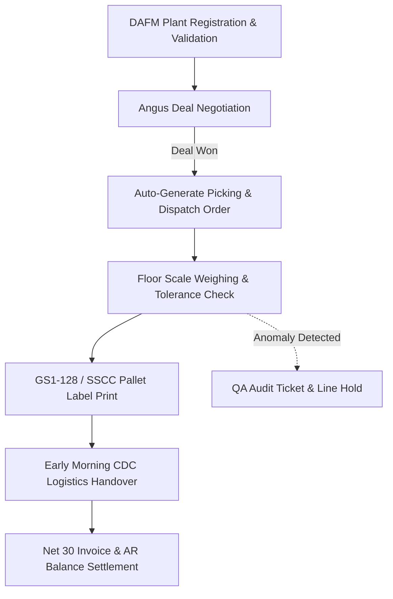

# 🥩 MeatFlow Ireland — Industrial CRM & Traceability Suite

[](#)
[](#)
[](#)
[](#)

> An enterprise-grade, domain-driven CRM & ERP workflow engine specifically architected for the **Irish meat and food processing industry**. Designed to bridge commercial contract negotiations, DAFM veterinary regulatory compliance, factory-floor scale weighing, and EU beef traceability into a seamless **Lead-to-Cash** lifecycle.

---

## 📸 System Showcase

<div align="center">
  
  <p><em>⚡ 10-Second Lead-to-Cash Interactive Guided Tour: Entity sync, DAFM compliance, and automated dispatch.</em></p>
</div>

| Full Operational Dashboard & RBAC | GS1-128 Pallet Label & DAFM Health Mark |
| :---: | :---: |
|  |  |
---

## 🌟 Key Functional Capabilities

### 1. 🔄 6-Entity Relational Data Mesh
* **Reactive Event-Bus Architecture**: Complete relational integrity across `Companies`, `Contacts`, `Deals`, `Orders`, `Tasks`, and `Tickets`.
* **Lead-to-Cash Automation**: Winning a commercial beef deal immediately auto-generates dispatch picking orders, updates live AR exposures, triggers logistics tasks, and reconciles payments upon dock delivery.

### 2. 🏛️ Irish Regulatory & Food Safety Compliance
* **DAFM Establishment Code Validation**: Integrated real-time regex & checksum verification for Irish Department of Agriculture, Food and the Marine approved meat plants (e.g., `IE 621 EC`).
* **EU Beef Traceability (EC No 1760/2000)**: Mandatory tracking across all stages: *Born in*, *Reared in*, *Slaughtered in*, and *Cut/Deboned in Ireland*.
* **Bord Bia MPQAS Standards**: Built-in adherence to the Meat Processor Quality Assurance Scheme.

### 3. ⚖️ Factory-Floor Catch-Weight & Logistics Labeling
* **Variable-Weight Tolerance Engine**: Dynamic catch-weight validation for non-standard primals, flagging real-time variance against target carcass orders within a strict $\pm 3\%$ commercial tolerance.
* **Dual GS1-128 / SSCC Logistics Generator**: Automated vector rendering of standard $100\text{ mm} \times 150\text{ mm}$ physical shipping labels featuring:
  * Application Identifiers: `AI (01)` GTIN-14, `AI (3102)` Net Weight, `AI (10)` Batch Lot.
  * Serial Shipping Container Code: `AI (00)` SSCC pallet serial identifier.
  * Clean `@media print` CSS targeting direct Zebra thermal label printing.

### 4. 🤖 AI Replenishment Prediction & Data Lineage
* **Smart Replenishment Engine**: Heuristic modeling analyzing retail purchasing cadences (e.g., Dunnes Stores, Musgrave) and chilled meat shelf-life decay, calculating order probability scores (0–100%) and auto-drafting forward production deals.
* **Full Data Lineage Pipeline**: Interactive topology tracking primal cuts from live cattle slaughter batches down through deboning, cold-storage allocations, delivery dockets (e-POD), and Net 30 invoicing.

### 5. 👥 Dual Role-Based Operational Views (RBAC)
* **Plant QA Auditor**: Focuses on veterinary health marks, HACCP audit trails, and sanitizer verification, masking commercial financial metrics.
* **Finance Controller**: Full visibility over Accounts Receivable (A/R) ledgers, credit exposure alerts, and credit-hold override workflows.

---

## 🔄 The Industrial Lead-to-Cash Pipeline



## 🛠️ Architecture & Tech Stack

* **Frontend Engine**: Modern Vanilla JavaScript (ES6+), Event-Driven Pub/Sub Pattern.
* **UI & Styling**: Tailwind CSS, Lucide Icons, industrial status colorimetry.
* **Data Layer**: High-resilience `localStorage` persistence with seed schemas and dynamic migrations.
* **Barcode Processing**: Dynamic canvas vector rendering powered by `bwip-js`.
* **Testing & Seed Data**: Pre-loaded with official registry data of approved Irish meat processing establishments across County Meath, Cork, Cavan, and Waterford.

---

## ⚡ Quick Start (Local Setup)

Clone the repository and launch instantly—zero dependencies or complex compile steps required:

```bash
# 1. Clone the repository
git clone [https://github.com/yuanindublin/irish-food-erp-crm.git](https://github.com/yuanindublin/irish-food-erp-crm.git)

# 2. Navigate to project root
cd irish-food-erp-crm

# 3. Open directly in your browser or run via Live Server
open index.html
```

> **Reviewer's Note**: Click the pulsing **`⚡ Demo Tour`** button in the top navigation bar to trigger an automated 60-second interactive guided walkthrough of the full commercial-to-production lifecycle.

---

## 📁 Repository Structure

```text
├── index.html                  # Standalone SPA Application (Reactive Engine & UI)
├── assets/                     # Architecture diagrams and system screenshots
│   ├── demo.gif
│   ├── dashboard_preview.png
│   └── pallet_label_preview.png
├── data/                       # Reference datasets (DAFM Approved Meat Plants)
│   └── dafm_reference_plants.json
└── README.md                   # Technical Documentation & Specification
```


